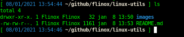

# Repositório linux-utils
Linux Utils Commands
Se te ajudou, deixe um comentario em:
[https://www.linkedin.com/in/flinox/](https://www.linkedin.com/in/flinox/)

# Shell
- Interface entre o usuario e o sistema unix/linux
- Interpretador de instruções

Usuario < **Shell** < Kernel < Hardware

## Tipos de shell

- **sh** ( Bourne Shell ) - Padrao do unix, o original;
- **bash** ( Bourne-Again Shell ) - Padrao do Linux, compativel com sh mas com melhorias, tbm incorpora recursos do csh e ksh;
- **ksh** ( Korn Shell ) - Também uma melhoria do sh;
- **csh** ( C Shell ) - Traz para o shell recursos da linguagem C;

## Como saber qual shell estou usando ?
```
echo $0
```
ou
```
echo $SHELL
```


# Dicas Úteis

## Personalizando seu prompt e comandos usando bash.

Para sempre rodar incluir no arquivo ```.bashrc``` que fica no home do usuário.

### Para mudar o prompt do shell

```
export PS1="[ \e[0;34m\$(date +'%d/%m/%Y %H:%M:%S')\e[m \e[1;37m\w\e[m ] "
```
Ficará assim:


Onde:

**```\e[0;34m```** 
Inicia a configuração de cor, 34 reprezenta azul;

**```$(date +'%d/%m/%Y %H:%M:%S')```** Define e exibe o formato de data como DD/MM/YYYY HH:MM:SS

**```\e[m```** 
Encerra a configuração de cor, tudo que estiver dentro vai assumir a cor definida no inicio;

**```\w```** 
Exibe o path do diretorio atual.

Cor   | Codigo
------|----
Preto | 0;30
Vermelho | 0;31
Verde | 0;32
Amarelo | 0;33
Azul | 0;34
Roxo | 0;35
Ciano | 0;36

Se trocar o 0 por 1 tem negrito, para maiores detalhes recomendo o site:

[How To Geek - Customize and Colorize your bash prompt](https://www.howtogeek.com/307701/how-to-customize-and-colorize-your-bash-prompt/)


### Fazer um override no comando ls para sempre rodar ls -ltr
```
alias ls='ls -ltr --color=auto'
```
Ficará assim:


## Dicas Gerais
Ajuda sobre um comando:
```
<comando> --help
```
```
man <comando>
```

Volta para o diretorio anterior:
```
cd - 
```
Vai para o home do usuario:
```
cd  
```
```
cd ~
```
Lista arquivos ordenando do mais velho para o mais novo:
```
ls -ltr
```
Lista processos em execução
```
ps axu | more
```
Criar ou atualizar um arquivo existente
```
touch <nome_arquivo>
```
Imprimindo mensagem sem quebra de linha
```
echo -n "fernando lino silva"
```
Imprimindo mensagens aceitando parametros especiais na mensagem
```
echo -e "fernando lino\t silva"
```
Criando uma hierarquia de diretorios em um comando
```
mkdir -p dir1/dir2/dir3/dir4
```
Remover arquivo e ignorar caso ele nao exista
```
rm -f <arquivo>
```
Sleep / Delay Contar tempo
```
sleep <segundos>
```
